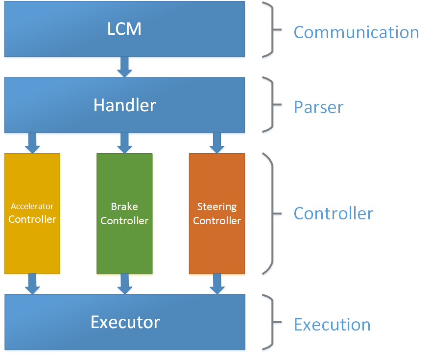

# OldDriver

The goal of this project is to achieve an awesome controller of an unmanned car. It is a pure linux project running on x86 architeture machine. Thanks to boost, we can use IPC mechanism to pass the message between three part of the controller, accelerator, brake and steering. Outside the controller, we use LCM(Lightweight Communications and Marshalling) to communicate with the application layer.

## Architecture



## Preinstallation

1. **Boost** environment, no minimum version aquired, just support message queue function, with cmake associated.
2. **Pthread** header file, in general it exists on every linux system, if not, get one.
3. **LCM** environment, follow the official installation guide.
4. **CMake**, at least version 2.8.

## Usage

```bash
# generate the makefile
mkdir build
cd build
cmake ..
# compile and build
make
# test the code
make test
# run the program
make run
# stop the program
Ctrl + C
```

## Acknowledgements

- [lcm](https://github.com/lcm-proj/lcm), Lightweight Communications and Marshalling
- [boost](https://github.com/boostorg/boost), a C++ libraries
- [cmake](https://github.com/Kitware/CMake), the cross-platform, open-source build system
